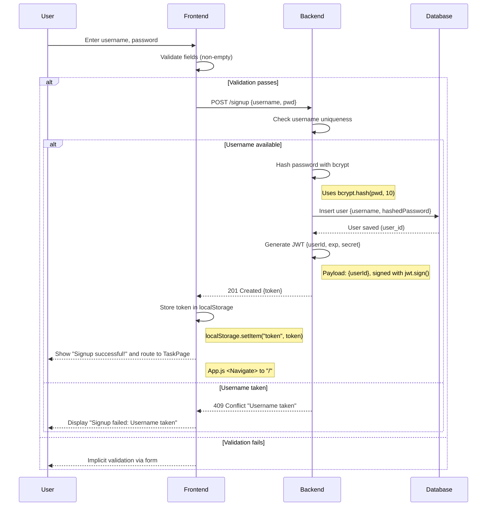
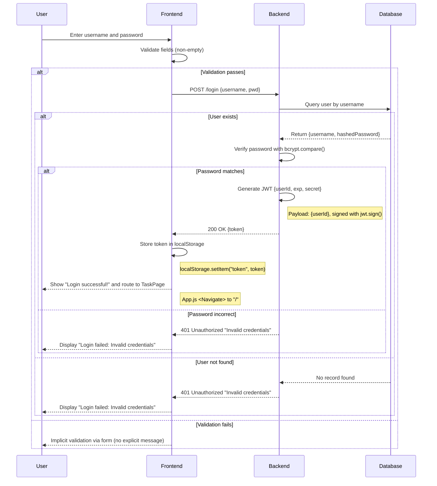
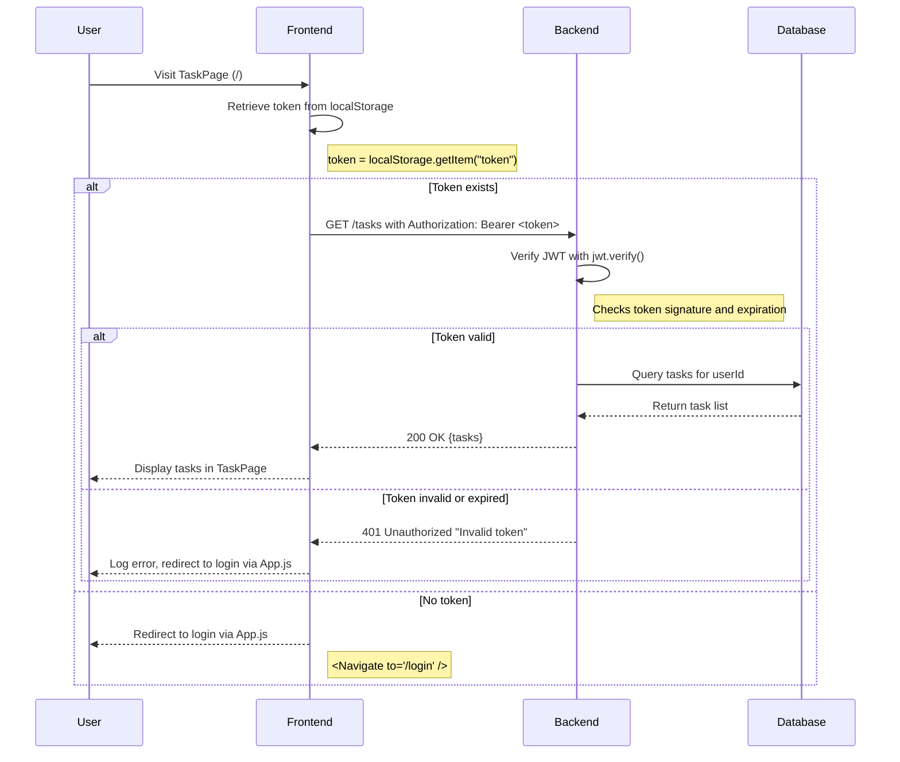

# Authentication Flows

## Sign-Up Flow

```mermaid
sequenceDiagram
  participant U as User
  participant F as Frontend
  participant B as Backend
  participant D as Database
  U->>F: Enter username, password
  F->>F: Validate fields (non-empty)
  alt Validation passes
    F->>B: POST /signup {username, pwd}
    B->>B: Check username uniqueness
    alt Username available
      B->>B: Hash password with bcrypt
      Note right of B: Uses bcrypt.hash(pwd, 10)
      B->>D: Insert user {username, hashedPassword}
      D-->>B: User saved (user_id)
      B->>B: Generate JWT {userId, exp, secret}
      Note right of B: Payload: {userId}, signed with jwt.sign()
      B-->>F: 201 Created {token}
      F->>F: Store token in localStorage
      Note right of F: localStorage.setItem("token", token)
      F-->>U: Show "Signup successful!" and route to TaskPage
      Note right of F: App.js <Navigate> to "/"
    else Username taken
      B-->>F: 409 Conflict "Username taken"
      F-->>U: Display "Signup failed: Username taken"
    end
  else Validation fails
    F-->>U: Implicit validation via form
  end
```

## Sign-In Flow

```mermaid
sequenceDiagram
  participant U as User
  participant F as Frontend
  participant B as Backend
  participant D as Database
  U->>F: Enter username and password
  F->>F: Validate fields (non-empty)
  alt Validation passes
    F->>B: POST /login {username, pwd}
    B->>D: Query user by username
    alt User exists
      D-->>B: Return {username, hashedPassword}
      B->>B: Verify password with bcrypt.compare()
      alt Password matches
        B->>B: Generate JWT {userId, exp, secret}
        Note right of B: Payload: {userId}, signed with jwt.sign()
        B-->>F: 200 OK {token}
        F->>F: Store token in localStorage
        Note right of F: localStorage.setItem("token", token)
        F-->>U: Show "Login successful!" and route to TaskPage
        Note right of F: App.js <Navigate> to "/"
      else Password incorrect
        B-->>F: 401 Unauthorized "Invalid credentials"
        F-->>U: Display "Login failed: Invalid credentials"
      end
    else User not found
      D-->>B: No record found
      B-->>F: 401 Unauthorized "Invalid credentials"
      F-->>U: Display "Login failed: Invalid credentials"
    end
  else Validation fails
    F-->>U: Implicit validation via form (no explicit message)
  end
```

## /GET Users

```mermaid
sequenceDiagram
  participant U as User
  participant F as Frontend
  participant B as Backend
  participant D as Database
  U->>F: Visit TaskPage (/)
  F->>F: Retrieve token from localStorage
  Note right of F: token = localStorage.getItem("token")
  alt Token exists
    F->>B: GET /tasks with Authorization: Bearer <token>
    B->>B: Verify JWT with jwt.verify()
    Note right of B: Checks token signature and expiration
    alt Token valid
      B->>D: Query tasks for userId
      D-->>B: Return task list
      B-->>F: 200 OK {tasks}
      F-->>U: Display tasks in TaskPage
    else Token invalid or expired
      B-->>F: 401 Unauthorized "Invalid token"
      F-->>U: Log error, redirect to login via App.js
    end
  else No token
    F-->>U: Redirect to login via App.js
    Note right of F: <Navigate to="/login" />
  end
```
