# Authentication Flows

## Sign-Up Flow

```mermaid
sequenceDiagram
  participant U as User
  participant F as Frontend
  participant B as Backend
  participant D as Database
  U->>F: Enter username, password, confirm_password
  F->>F: Validate fields (e.g., password match, non-empty)
  alt Validation passes
    F->>B: POST /signup {username, password}
    B->>B: Check username uniqueness
    alt Username available
      B->>B: Hash password with bcrypt
      Note right of B: Uses bcrypt.genSalt(10) and bcrypt.hash()
      B->>D: Insert user {username, hashedPassword}
      D-->>B: User saved (user_id)
      B->>B: Generate JWT {username, exp, secret}
      Note right of B: Payload: {sub: username, iat, exp}, signed with jwt.sign()
      B-->>F: 201 Created {token}
      F->>F: Store token in localStorage
      Note right of F: localStorage.setItem("token", token)
      F-->>U: Redirect to dashboard
    else Username taken
      B-->>F: 409 Conflict {error: "Username already taken"}
      F-->>U: Display "Username already taken"
    end
  else Validation fails
    F-->>U: Display "Invalid input (e.g., passwords don’t match)"
  end
```

## Sign-In Flow

## /GET Users
``` mermaid
sequenceDiagram
  participant U as User
  participant F as Frontend
  participant B as Backend
  participant D as Database
  U->>F: Request to view user lists
  F->>F: Retrieve token from localStorage
  Note right of F: token = localStorage.getItem("token")
  alt Token exists
    F->>B: GET /users with Authorization: Bearer <token>
    B->>B: Verify JWT with jwt.verify()
    Note right of B: Checks token signature and expiration
    alt Token valid
      B->>D: Query all users
      D-->>B: Return users_list
      B-->>F: 200 OK {users_list}
      F-->>U: Display users list
    else Token invalid or expired
      B-->>F: 401 Unauthorized {error: "Invalid or expired token"}
      F-->>U: Display "Please log in again"
    end
  else No token
    F-->>U: Display "Please log in to access this resource"
  end
